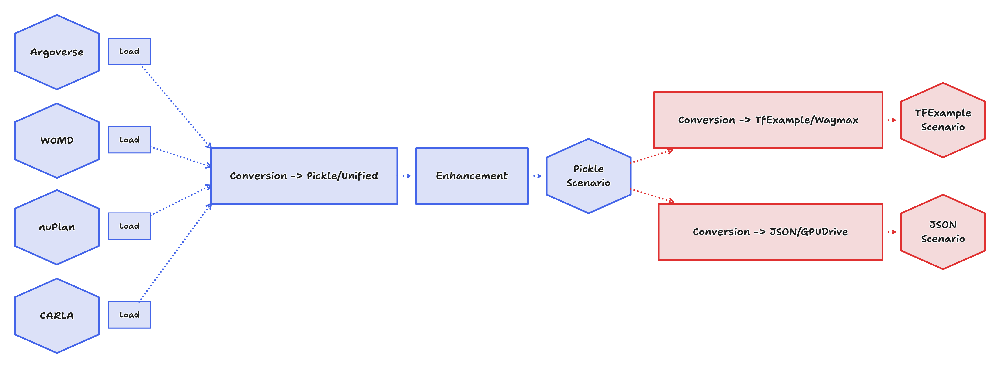

# ScenarioMax

[](https://www.python.org/downloads/)
[](https://opensource.org/licenses/MIT)

> A high-performance toolkit for autonomous vehicle scenario-based testing and dataset conversion

ScenarioMax is an extension to [ScenarioNet](https://github.com/metadriverse/scenarionet) that transforms various autonomous driving datasets into standardized formats. Like ScenarioNet, it first converts different datasets (Waymo, nuPlan, nuScenes) to a unified pickle format. ScenarioMax then extends this process with additional pipelines to convert this unified data into formats compatible with [Waymax](https://github.com/waymo-research/waymax), [V-Max](https://github.com/valeoai/V-Max), and [GPUDrive](https://github.com/Emerge-Lab/gpudrive).


<div align="center">
  
</div>

## 🚀 Key Features

- **Multi-Dataset Support**: Unified interface for Waymo Open Motion Dataset, nuScenes, nuPlan, and OpenScenes
- **Flexible Output Formats**: Convert to TFExample (Waymax/V-Max), JSON (GPUDrive), or unified pickle format
- **High Performance**: Parallel processing with memory optimization and progress monitoring
- **3-Stage Pipeline Architecture**: Convert → Process → Format for maximum flexibility
- **Enhanced Scenarios**: Optional scenario enhancement with customizable processing steps
- **Visualization**: Bird's Eye View (BEV) rendering of scenarios with matplotlib

## 📋 Table of Contents

- [Installation](#installation)
- [Quick Start](#quick-start)
- [Usage Examples](#usage-examples)
- [Supported Datasets](#supported-datasets)
- [Output Formats](#output-formats)
- [Architecture](#architecture)
- [Development](#development)
- [Contributing](#contributing)
- [License](#license)

## 🛠️ Installation

### Prerequisites

- Python 3.10
- [uv](https://docs.astral.sh/uv/) for fast dependency management
- Access to at least one supported dataset (Waymo, nuPlan, or nuScenes)
- Sufficient disk space for dataset processing

### Basic Installation

```bash
# Clone the repository
git clone https://github.com/valeoai/ScenarioMax.git
cd ScenarioMax

# Create and activate virtual environment
uv venv -p 3.10
source .venv/bin/activate

# Install ScenarioMax with dataset support
make waymo          # Waymo Open Motion Dataset
make nuplan        # nuPlan dataset
make nuscenes      # nuScenes dataset
make all           # All datasets
make dev           # Development environment
```

### Manual Installation

```bash
# For specific datasets
uv pip install -e ".[waymo]"      # Waymo support
uv pip install -e ".[nuplan]"    # nuPlan support
uv pip install -e ".[nuscenes]"  # nuScenes support
uv pip install -e ".[dev]"       # Development tools
uv pip install -e ".[all]"       # All datasets support
```

### Environment Setup

For nuPlan dataset, set required environment variables:

```bash
export NUPLAN_MAPS_ROOT=/path/to/nuplan/maps
export NUPLAN_DATA_ROOT=/path/to/nuplan/data
```

## 🚀 Quick Start

### 3-Stage Pipeline

ScenarioMax uses a flexible 3-stage pipeline:

```
Stage 1: Convert  - Raw dataset(s) → Unified pickles
Stage 2: Process  - Unified pickles → Enhanced pickles (optional)
Stage 3: Format   - Unified pickles → Target format (tfrecord/json)
```

### Basic Usage

```bash
# Stage 1: Convert raw Waymo to unified format
scenariomax convert --waymo_src /data/waymo --dst /output/unified --num_workers 16

# Stage 2: Process unified scenarios (optional)
scenariomax process --src /output/unified --dst /output/processed --traffic-lights

# Stage 3: Convert to TFRecord
scenariomax format --src /output/processed --dst /output/tfrecord --format tfexample --shard 10

# Or run all 3 stages at once
scenariomax pipeline --waymo_src /data/waymo --dst /output --format tfexample --process --shard 10

# Visualize unified scenarios (BEV PNG images)
scenariomax viz --src /output/unified --dst /output/viz --timestep 10 --max-scenarios 100
```

## 📊 Usage Examples

### Use Case 1: Single Dataset Conversion

```bash
# Convert Waymo to TFRecord format
scenariomax pipeline \
  --waymo_src /data/waymo \
  --dst /output \
  --format tfexample \
  --num_workers 8
```

### Use Case 2: Multi-Dataset Processing

```bash
# Combine Waymo and nuPlan datasets
scenariomax pipeline \
  --waymo_src /data/waymo \
  --nuplan_src /data/nuplan \
  --dst /output \
  --format tfexample \
  --shard 10 \
  --num_workers 16
```

### Use Case 3: Enhanced Processing Pipeline

```bash
# Add traffic light processing
scenariomax pipeline \
  --waymo_src /data/waymo \
  --dst /output \
  --format tfexample \
  --process \
  --traffic-lights \
  --num_workers 8
```

### Use Case 4: Visualization Workflow

```bash
# Stage 1: Convert to unified format
scenariomax convert --waymo_src /data/waymo --dst /unified --num_workers 8

# Visualize scenarios
scenariomax viz --src /unified --dst /viz --timestep 10 --max-scenarios 50

# Stage 3: Convert to target format
scenariomax format --src /unified --dst /output --format json --num_workers 8
```

## 🗂️ Supported Datasets


| Dataset | Version | Link | Status |
|---------|---------|------|--------|
| Waymo Open Motion Dataset | v1.3.0 | [Site](https://waymo.com/open/download/) | ✅ Full Support |
| nuPlan | v1.1 | [Site](https://www.nuscenes.org/nuplan) | ✅ Full Support |
| nuScenes | v1.0 | [Site](https://www.nuscenes.org/nuscenes) | 🚧 WIP|
| Argoverse | v2.0 | [Site](https://www.argoverse.org/av2.html#forecasting-link) | 🚧 WIP |

### Dataset-Specific Options

```bash
# nuScenes with specific split
scenariomax \
  --nuscenes_src /data/nuscenes \
  --split v1.0-trainval \
  --dst /output \
  --target_format tfexample

# nuPlan with direct log parsing
scenariomax \
  --nuplan_src /data/nuplan \
  --nuplan_direct_from_logs \
  --dst /output \
  --target_format gpudrive
```

## 📤 Output Formats

### TFRecord (TensorFlow/Waymax)

```bash
--target_format tfexample
```

- **Use Case**: Training neural networks with Waymax/V-Max
- **Output**: `training.tfrecord` files with sharding support

### GPUDrive JSON

```bash
--target_format gpudrive
```

- **Use Case**: GPU-accelerated simulation and training
- **Output**: JSON files compatible with GPUDrive simulator

### Unified Pickle Format

```bash
--target_format pickle
```

- **Use Case**: Intermediate format for custom processing
- **Features**: Full scenario data preservation, Python-native
- **Output**: `.pkl` files with complete scenario information

## 🏗️ Architecture

ScenarioMax uses a **3-stage pipeline architecture**:

```
Stage 1: Convert  →  Stage 2: Process  →  Stage 3: Format
Raw Data          →  Unified Format     →  Target Format
[Dataset]         →  [Enhancement]      →  [ML Ready]
```

### Pipeline Stages

1. **Stage 1 (convert)**: Raw dataset(s) → Unified pickles
   - Dataset-specific parsers convert native formats to standardized format
   - Supports multiple datasets simultaneously
   - Output: Pickle files with unified scenario data

2. **Stage 2 (process)**: Unified → Enhanced (Optional)
   - Apply transformations, filtering, or augmentation
   - Traffic light inference, object filtering, etc.
   - Output: Enhanced pickle files

3. **Stage 3 (format)**: Unified → Target format
   - Convert to training-ready formats (TFRecord, JSON)
   - Optional sharding for TFRecord output
   - Output: Format-specific files

### Additional Tools

- **viz**: Visualize unified scenarios as Bird's Eye View (BEV) PNG images
- **pipeline**: Run all 3 stages together in-memory or with intermediate disk writes

### Key Components

- **`pipeline.py`**: Main orchestrator with multi-dataset support
- **`dataset_registry.py`**: Dynamic dataset configuration system
- **`stage1_convert/`**: Dataset-specific extractors and converters
- **`stage2_process/`**: Enhancement processors (traffic lights, etc.)
- **`stage3_format/`**: Target format converters (tfexample, json)
- **`visualization/`**: BEV rendering with matplotlib
- **`core/write.py`**: Parallel processing with memory management

## 🔧 Configuration

### Command Line Options

```bash
# Processing options
--num_workers 8              # Parallel workers (default: 8)
--shard 1000                 # Output sharding
--num_files 100              # Limit files processed
--enable_enhancement         # Enable scenario enhancement

# Dataset options
--split v1.0-trainval        # nuScenes data split
--nuplan_direct_from_logs    # Alternative nuPlan parsing

# Output options
--tfrecord_name training     # TFRecord filename
--log_level INFO             # Logging verbosity
--log_file /path/to/log      # Log file location
```


## 📚 Additional Resources

- [Architecture Documentation](docs/ARCHITECTURE.md)
- [API Reference](docs/API.md)


## 📄 License

This project is licensed under the MIT License - see the [LICENSE](LICENSE) file for details.
