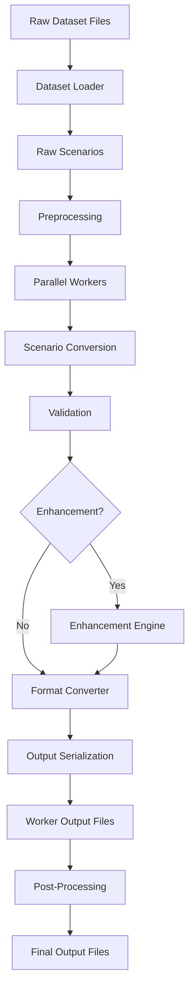

# ScenarioMax Architecture

This document provides a comprehensive overview of ScenarioMax's architecture, design patterns, and implementation details.

## Table of Contents

- [Overview](#overview)
- [Two-Stage Pipeline Architecture](#two-stage-pipeline-architecture)
- [Core Components](#core-components)
- [Data Flow](#data-flow)
- [Parallel Processing](#parallel-processing)
- [Memory Management](#memory-management)
- [Error Handling](#error-handling)
- [Extension Points](#extension-points)

## Overview

ScenarioMax is built around a **two-stage pipeline architecture** that provides flexibility, maintainability, and performance for processing autonomous driving datasets. The architecture separates concerns between dataset-specific parsing and target format generation, enabling easy extensibility and reuse.

### Design Principles

1. **Separation of Concerns**: Clear boundaries between dataset parsing, format conversion, and processing orchestration
2. **Extensibility**: Plugin-based architecture for datasets and output formats
3. **Performance**: Parallel processing with memory optimization
4. **Reliability**: Comprehensive error handling and validation
5. **Maintainability**: Clean abstractions and consistent patterns

## Two-Stage Pipeline Architecture

```
┌─────────────┐    ┌──────────────────┐    ┌─────────────────┐
│  Raw Data   │───▶│ Unified Format   │───▶│ Target Format   │
│             │    │                  │    │                 │
│ • Waymo     │    │ • Standardized   │    │ • TFRecord      │
│ • nuScenes  │    │ • Validated      │    │ • GPUDrive JSON │
│ • nuPlan    │    │ • Enhanced       │    │ • Custom        │
│ • OpenScenes│    │ • Python Native  │    │                 │
└─────────────┘    └──────────────────┘    └─────────────────┘
       │                      │                      │
       ▼                      ▼                      ▼
 [Raw-to-Unified]      [Enhancement]         [Unified-to-Target]
    Extractors           (Optional)             Converters
```

### Stage 1: Raw to Unified

**Purpose**: Convert dataset-specific formats to a standardized representation

**Components**:
- Dataset-specific extractors (`raw_to_unified/datasets/`)
- Data validation and sanitization
- Coordinate system normalization
- Type mapping and standardization

**Output**: Python dictionaries following the `UnifiedScenario` schema

### Stage 2: Unified to Target

**Purpose**: Convert unified format to training/simulation-ready formats

**Components**:
- Target format converters (`unified_to_tfexample/`, `unified_to_gpudrive/`)
- Format-specific optimizations
- Serialization and compression
- Output file management

**Output**: Format-specific files (TFRecord, JSON, etc.)

### Optional Enhancement Stage

**Purpose**: Apply transformations, filtering, or augmentation to scenarios

**Features**:
- Scenario filtering based on criteria
- Data augmentation (planned)
- Custom transformations
- Quality validation

## Core Components

### 1. Pipeline Orchestrator (`core/pipeline.py`)

The central coordinator that manages the entire conversion process.

```python
def convert_dataset(
    source_type: str,           # "raw" or "pickle"
    source_paths: dict,         # Dataset paths
    target_format: str,         # Output format
    output_path: str,           # Destination
    enhancement: bool = False,  # Enable enhancement
    stream_mode: bool = False,  # Memory-efficient processing
    num_workers: int = 8,       # Parallel workers
    **kwargs
) -> dict
```

**Key Responsibilities**:
- Coordinate multi-dataset processing
- Manage processing modes (batch vs. streaming)
- Handle temporary file cleanup
- Aggregate processing statistics

### 2. Dataset Registry (`dataset_registry.py`)

Dynamic configuration system for supported datasets.

```python
@dataclass
class DatasetConfig:
    name: str                    # Dataset identifier
    version: str                 # Dataset version
    load_func: Callable         # Scenario loading function
    convert_func: Callable      # Conversion function
    preprocess_func: Callable   # Optional preprocessing
    additional_args: dict       # Extra configuration
```

**Pattern**: Registry pattern with lazy loading to avoid circular imports

### 3. Parallel Processing Engine (`core/write.py`)

Handles parallel scenario processing with memory management.

**Architecture**:
```
Main Process
    │
    ├── Worker 0 ── [Scenarios 0-99]   ── Output Dir 0/
    ├── Worker 1 ── [Scenarios 100-199] ── Output Dir 1/
    ├── Worker 2 ── [Scenarios 200-299] ── Output Dir 2/
    └── Worker N ── [Scenarios N*100-...] ── Output Dir N/
    
Post-Processing: Merge worker outputs into final format
```

**Features**:
- Joblib-based parallel processing
- Per-worker memory monitoring 
- Automatic workload distribution
- Worker isolation and error handling

### 4. Format Converters

#### TFExample Converter (`unified_to_tfexample/`)

Converts unified scenarios to TensorFlow TFRecord format.

**Structure**:
```
unified_to_tfexample/
├── convert_to_tfexample.py    # Main conversion logic
├── converter/
│   ├── state.py              # Agent state conversion
│   ├── roadgraph.py          # Map element conversion
│   ├── traffic_light.py      # Traffic light conversion
│   └── utils.py              # Conversion utilities
├── postprocess.py            # Worker coordination
├── shard_tfexample.py        # File sharding
└── exceptions.py             # Format-specific exceptions
```

#### GPUDrive Converter (`unified_to_gpudrive/`)

Converts unified scenarios to GPUDrive JSON format.

**Structure**:
```
unified_to_gpudrive/
├── convert_to_json.py        # Main conversion logic
├── converter/
│   ├── state.py              # State conversion
│   ├── roadgraph.py          # Roadgraph conversion
│   └── traffic_light.py      # Traffic light conversion
├── postprocess.py            # Output management
└── utils.py                  # Helper functions
```

## Data Flow

### Detailed Processing Flow



### Data Transformations

#### 1. Raw to Unified Schema

Each dataset has specific extraction logic:

**Waymo**:
```python
def convert_waymo_scenario(scenario, version):
    return {
        ScenarioDescription.ID: extract_scenario_id(scenario),
        ScenarioDescription.METADATA: extract_metadata(scenario),
        ScenarioDescription.DYNAMIC_AGENTS: extract_agents(scenario),
        ScenarioDescription.MAP_ELEMENTS: extract_map(scenario),
        ScenarioDescription.TIMESTEPS: extract_timesteps(scenario),
        # ... other fields
    }
```

**nuScenes**:
```python
def convert_nuscenes_scenario(scenario, version):
    # Different extraction logic but same output schema
    return unified_scenario_dict
```

#### 2. Unified Schema

The unified format follows a consistent structure:

```python
{
    "id": "scenario_unique_identifier",
    "version": "dataset_version",
    "metadata": {
        "dataset_name": "waymo|nuscenes|nuplan",
        "dataset_version": "version_string",
        "source_file": "original_file_path"
    },
    "timesteps": [0.0, 0.1, 0.2, ...],  # Time array
    "dynamic_agents": {
        "agent_id": {
            "type": "vehicle|pedestrian|cyclist",
            "position": [[x, y], ...],      # Per timestep
            "heading": [theta, ...],         # Per timestep
            "velocity": [[vx, vy], ...],     # Per timestep
            "valid": [True, False, ...],     # Per timestep
            "size": [length, width, height]  # Static
        }
    },
    "map_elements": {
        "element_id": {
            "type": "lane|crosswalk|stop_sign|...",
            "geometry": [[x, y], ...],       # Polyline/polygon
            "properties": {...}              # Element-specific data
        }
    },
    "dynamic_map_elements": {
        "traffic_light_id": {
            "type": "traffic_light",
            "states": ["red", "green", ...], # Per timestep
            "position": [x, y],
            "controlled_lanes": ["lane_id1", ...]
        }
    }
}
```

#### 3. Unified to Target Formats

**TFExample**: Converts to TensorFlow features
```python
features = {
    "state/x": tf.train.Feature(float_list=...),
    "state/y": tf.train.Feature(float_list=...),
    "roadgraph_samples/xyz": tf.train.Feature(float_list=...),
    # ... many more features
}
```

**GPUDrive JSON**: Converts to simulation format
```python
{
    "scenario_id": "...",
    "agents": [{
        "position": [...],
        "heading": [...],
        "type": "vehicle"
    }],
    "map": {
        "lanes": [...],
        "intersections": [...]
    }
}
```

## Parallel Processing

### Worker Architecture

ScenarioMax uses a **process-based parallel processing model** with joblib:

```python
# Main process distributes work
worker_args = distribute_scenarios(scenarios, num_workers)

# Parallel execution
results = Parallel(n_jobs=num_workers, backend="multiprocessing")(
    delayed(process_worker)(args) for args in worker_args
)
```

### Worker Isolation

Each worker operates independently:
- **Separate output directories**: `output/worker_0/`, `output/worker_1/`, etc.
- **Memory tracking**: Per-worker memory monitoring
- **Error isolation**: Worker failures don't crash other workers
- **Progress tracking**: Individual progress bars per worker

### Load Balancing

Scenarios are distributed across workers using several strategies:

1. **Round-robin**: Simple distribution for uniform scenarios
2. **Size-based**: Distribute based on scenario complexity (planned)
3. **Dynamic**: Reassign work from failed workers (planned)

### Memory Management

#### Worker Memory Monitoring

```python
def process_memory():
    process = psutil.Process(os.getpid())
    mem_info = process.memory_info()
    return {
        'rss': mem_info.rss / 1024 / 1024,      # MB
        'vms': mem_info.vms / 1024 / 1024,      # MB
        'percent': process.memory_percent()      # %
    }
```

#### Memory Optimization Strategies

1. **Generator-based processing**: Stream data instead of loading all in memory
2. **Preprocessing functions**: Dataset-specific memory optimization
3. **Configurable worker limits**: Adjust based on available RAM
4. **Garbage collection**: Explicit memory cleanup between scenarios

#### Waymo-Specific Memory Management

```python
def preprocess_waymo_scenarios(files, worker_index):
    """Generator-based processing for memory efficiency."""
    logger.info(f"Worker {worker_index} processing {len(files)} files")
    
    for file in files:
        # Process one file at a time to minimize memory usage
        scenarios = load_waymo_file(file)
        for scenario in scenarios:
            yield scenario
        # File data is garbage collected here
```

## Error Handling

### Exception Hierarchy

ScenarioMax implements a comprehensive exception hierarchy:

```python
ScenarioMaxError (base)
├── DatasetError
│   ├── UnsupportedDatasetError
│   ├── DatasetLoadError
│   └── EmptyDatasetError
├── ConversionError
│   ├── UnsupportedFormatError
│   ├── ScenarioConversionError
│   └── WorkerProcessingError
├── ValidationError
│   ├── InvalidScenarioDataError
│   ├── OverpassException
│   └── NotEnoughValidObjectsException
└── ConfigurationError
    ├── MissingEnvironmentVariableError
    └── InvalidConfigurationError
```

### Error Recovery Strategies

1. **Scenario-level**: Skip invalid scenarios, continue processing
2. **Worker-level**: Restart failed workers with remaining work
3. **Dataset-level**: Continue with other datasets if one fails
4. **Pipeline-level**: Clean up resources and provide detailed error reports

### Validation Pipeline

```python
def validate_scenario(scenario: dict) -> None:
    """Multi-level validation."""
    # Schema validation
    validate_required_fields(scenario)
    
    # Data integrity validation
    validate_timestep_consistency(scenario)
    validate_agent_trajectories(scenario)
    
    # Dataset-specific validation
    if scenario['metadata']['dataset_name'] == 'waymo':
        validate_waymo_specific_fields(scenario)
```

## Extension Points

### Adding New Datasets

1. **Create dataset module**:
   ```
   raw_to_unified/datasets/new_dataset/
   ├── __init__.py
   ├── load.py          # get_new_dataset_scenarios()
   ├── extractor.py     # convert_new_dataset_scenario()
   ├── types.py         # Dataset-specific type mappings
   └── utils.py         # Helper functions
   ```

2. **Register in dataset registry**:
   ```python
   if dataset_name == "new_dataset":
       from scenariomax.raw_to_unified.datasets import new_dataset
       return DatasetConfig(
           name="new_dataset",
           version="1.0",
           load_func=new_dataset.get_new_dataset_scenarios,
           convert_func=new_dataset.convert_new_dataset_scenario
       )
   ```

3. **Follow the interface**:
   ```python
   def get_new_dataset_scenarios(data_path: str, **kwargs) -> list:
       """Load scenarios from dataset."""
       pass
   
   def convert_new_dataset_scenario(scenario: Any, version: str) -> dict:
       """Convert to unified format."""
       pass
   ```

### Adding New Output Formats

1. **Create converter module**:
   ```
   unified_to_new_format/
   ├── __init__.py
   ├── convert_to_new_format.py    # Main conversion
   ├── postprocess.py              # Worker coordination
   ├── converter/                  # Component converters
   └── utils.py                    # Helper functions
   ```

2. **Implement conversion function**:
   ```python
   def convert_to_new_format(scenario: dict) -> Any:
       """Convert unified scenario to new format."""
       pass
   ```

3. **Add to pipeline registry**:
   ```python
   def _get_target_postprocess_func(target_format: str):
       if target_format == "new_format":
           from scenariomax.unified_to_new_format import postprocess
           return postprocess.postprocess_new_format
   ```

### Custom Enhancement Functions

```python
def custom_enhancement(unified_scenario: dict) -> dict:
    """Apply custom transformations to scenarios."""
    # Add noise to trajectories
    if random.random() < 0.1:
        add_trajectory_noise(unified_scenario)
    
    # Filter scenarios by criteria
    if not meets_criteria(unified_scenario):
        raise SkipScenarioException("Does not meet criteria")
    
    return unified_scenario

# Register enhancement
from scenariomax.enhancement import register_enhancement
register_enhancement("custom", custom_enhancement)
```

## Performance Considerations

### Bottlenecks and Optimizations

1. **I/O Bound Operations**:
   - Use SSD storage for better random access
   - Implement read-ahead caching for sequential access
   - Compress intermediate files to reduce disk usage

2. **CPU Bound Operations**:
   - Optimize number of workers based on CPU cores
   - Use vectorized operations (NumPy) where possible
   - Profile conversion functions for optimization opportunities

3. **Memory Bound Operations**:
   - Use generator-based processing for large datasets
   - Implement smart caching with LRU eviction
   - Monitor and limit per-worker memory usage

### Scalability Patterns

1. **Horizontal Scaling**: Run multiple instances across machines
2. **Vertical Scaling**: Optimize single-machine performance
3. **Cloud Scaling**: Use containerized workers in cloud environments

This architecture provides a solid foundation for processing autonomous driving datasets at scale while maintaining flexibility for future extensions and optimizations.